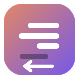
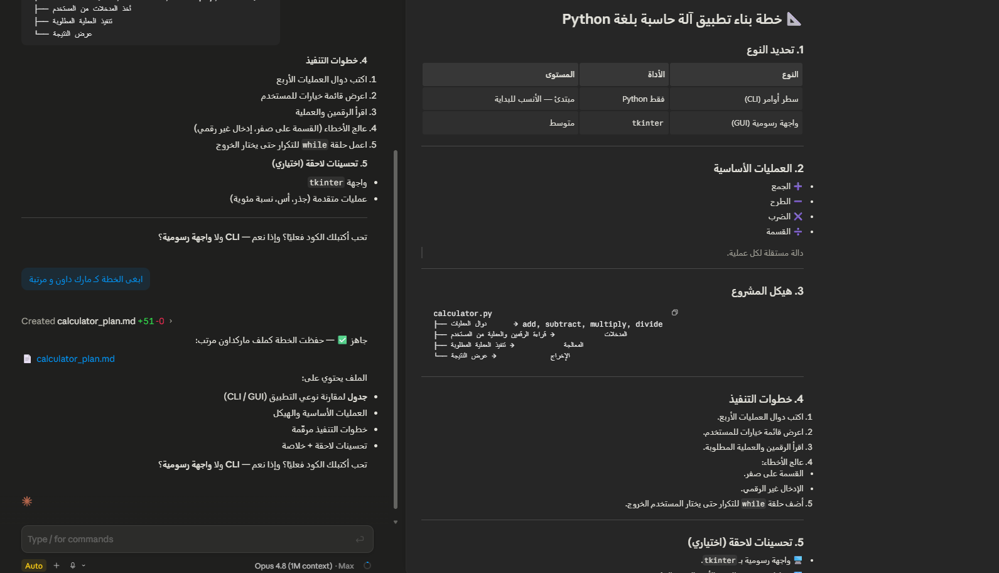

<div align="center">

# 🖋️ Claude Desktop RTL



### دعم العربية والكتابة من اليمين لليسار (RTL) في تطبيق Claude للكمبيوتر
#### Proper right‑to‑left (Arabic) support for the Claude Desktop app — Windows & macOS

<br/>

[](https://github.com/ikhd/claude-desktop-rtl/releases)
[](#-التثبيت)
[](LICENSE)
[](#)
[](https://github.com/ikhd/claude-desktop-rtl/stargazers)

`بنقرة واحدة` • `نفس التطبيق ونفس الدخول` • `يتحدّث تلقائياً` • `بدون نسخة ثانية`

</div>

---

<div dir="rtl">

## ✨ نظرة عامة

تطبيق **Claude** للكمبيوتر لا يعرض العربية من اليمين لليسار بشكل صحيح. هذه الأداة تحقن طبقة صغيرة في واجهته تجعل **كل فقرة تختار اتجاهها بنفسها** — العربي يمين، والإنجليزي والكود يسار — حتى لو كانوا مختلطين في نفس الرسالة، وتواكب الردود وهي تُكتب.

وتعدّل **تطبيقك الموجود مباشرةً**: نفس الأيقونة، نفس تسجيل الدخول، نفس المحادثات، وClaude Code / Cowork يظلّون شغّالين — ومهمة بالخلفية **تعيد تطبيق التعديل تلقائياً** بعد أي تحديث.

> 🧠 صُنعت بأسلوب أصلي: محرّك RTL واحد مشترك بين النظامين، ومثبّت أصلي لكل نظام.

---

## 🖥️ معاينة

<!-- أضف لقطة "قبل / بعد" هنا:    -->
<div align="center"><em>قريباً: صورة/GIF توضّح الفرق (قبل ↔ بعد).</em></div>

---

## ⚡ المميزات

| الميزة | الوصف |
|---|---|
| 🎯 **كشف اتجاه ذكي** | كل فقرة تتبع *أول حرف قوي* فيها (`dir="auto"`) — فلا تنقلب فقرة إنجليزية فيها كلمة عربية. |
| 🧩 **نفس التطبيق** | لا توجد نسخة ثانية؛ دخولك ومحادثاتك لا تُمَس. |
| ⌨️ **تبديل فوري** | `Ctrl+Alt+R` يشغّل/يطفّي RTL (ويُحفظ تلقائياً). |
| 🔁 **يصمد مع التحديثات** | يعيد تطبيق نفسه تلقائياً بعد كل تحديث لـ Claude. |
| 💻 **ويندوز + ماك** | محرّك واحد مشترك، ومثبّت أصلي لكل نظام. |
| 🧱 **يحترم الأكواد** | الأكواد والجداول والمعادلات تبقى LTR، مع طباعة عربية أوضح. |
| ↩️ **قابل للتراجع** | نسخة احتياطية كاملة + إلغاء بأمر واحد. |

---

## 📦 المتطلبات

- **Node.js** — تستخدمه أدوات التعديل (ويندوز يثبّته تلقائياً عبر `winget` لو ناقص).
- **ماك فقط:** `python3` + Xcode Command Line Tools.

---

## 🚀 التثبيت

**🪟 ويندوز** — دبل‑كليك على **`Claude-RTL.bat`** ووافق على طلب الأدمن (UAC)، ثم افتح Claude عادي.

**🍎 ماك**

```bash
bash install-mac.sh
```

> 🔐 أول تشغيل على ماك قد يطلب السماح لطرفيّتك من **System Settings → Privacy & Security → App Management** (مرة وحدة، بدون باسوورد).

---

## 🎛️ الاستخدام

- التبديل داخل Claude: **`Ctrl+Alt+R`**
- من الـ Console: `__claudeRTL.toggle()`

---

## 🔁 التحديث التلقائي

| النظام | الآلية |
|---|---|
| 🪟 ويندوز | مهمة مجدوّلة عند تسجيل الدخول تفحص الباتش وتعيده لو شاله تحديث. |
| 🍎 ماك | `LaunchAgent` يعيد تطبيق التعديل بعد تحديث Claude. |

---

## 🗂️ هيكل الملفات

```text
claude-desktop-rtl/
├── rtl-engine.js          # محرّك RTL المشترك (يُحقَن في الواجهة)
├── Claude-RTL.bat         # مشغّل ويندوز  → يستدعي المثبّت
├── install-windows.ps1    # مثبّت ويندوز (in-place) + تحديث تلقائي
├── install-mac.sh         # مثبّت ماك   (in-place) + تحديث تلقائي
├── auto-update.ps1        # فاحص التحديث على ويندوز
├── .gitattributes         # يضمن أسطر LF لكل من يحمّل المشروع
├── LICENSE                # MIT
└── README.md
```

---

## ⚙️ كيف يعمل

<details>
<summary><b>اضغط للتفاصيل التقنية</b></summary>

<br/>

- **`rtl-engine.js`** — الطبقة المحقونة في الواجهة. تضع `dir="auto"` على الكتل النصية وصندوق الكتابة عبر `MutationObserver` مُهَدّأ، تعزل الأكواد/الجداول LTR، وتحقن أنماطاً متوافقة مع CSP. مكتوبة بـ ASCII بالكامل حتى لا يفسدها أي مثبّت.
- **ويندوز (`install-windows.ps1`)** — يحقن المحرّك في `app.asar` ويعيد تغليفه، يحدّث هاش السلامة داخل `Claude.exe` ويعيد توقيعه، ويحدّث الشهادة المدمجة التي تتحقق منها الخدمة المرافقة (ليبقى Claude Code شغّالاً). مع نسخة احتياطية وتراجع تلقائي.
- **ماك (`install-mac.sh`)** — يحقن ويعيد التغليف، **يعيد حساب هاش رأس الـ asar ويحدّث `ElectronAsarIntegrity` في `Info.plist`** (تبقى السلامة مفعّلة)، يكتب الملفات داخل التطبيق عبر **Finder** بدون `sudo`، ويعيد التوقيع ad‑hoc.

</details>

---

## 🧹 إلغاء التثبيت

- **🪟 ويندوز:** `powershell -ExecutionPolicy Bypass -File install-windows.ps1 -Uninstall`
- **🍎 ماك:** `bash install-mac.sh --uninstall`

---

## ⚠️ تنبيه وأمان

تعديل مجتمعي على العميل، وقد يخالف شروط خدمة Anthropic — استخدمه لتحسين إمكانية الوصول وعلى مسؤوليتك. على ويندوز يضيف شهادة موقّعة ذاتياً لمخزن الجذر ويعيد توقيع ملفّين، فقد ينبّه مكافح الفيروسات. الحل الأمثل أن تدعم Anthropic الـ RTL أصلياً.

---

## 👤 المطوّر

صُنع بواسطة **[ikhd](https://github.com/ikhd)** — أدوات عربية لتحسين تجربة الذكاء الاصطناعي.

</div>

---

## English

<details open>
<summary><b>Read in English</b></summary>

### ✨ Overview
Claude Desktop doesn't render Arabic right‑to‑left. **Claude Desktop RTL** injects a tiny layer so every block resolves **its own** direction — Arabic goes RTL, English and code stay LTR — even when mixed in one message, and it keeps up while answers stream.

It patches **your existing Claude app in place**: same icon, same login, same chats, and Claude Code / Cowork keep working — and a background task **re-applies the patch automatically** after updates.

### ⚡ Features
| Feature | Description |
|---|---|
| 🎯 **Smart direction** | Each block follows its *first‑strong* character (`dir="auto"`) — an English paragraph with one Arabic word isn't flipped. |
| 🧩 **Same app** | No second copy; your login and chats are untouched. |
| ⌨️ **Instant toggle** | `Ctrl+Alt+R` turns RTL on/off (remembered). |
| 🔁 **Survives updates** | Auto re-applies after each Claude update. |
| 💻 **Windows + macOS** | One shared engine, native installer per OS. |
| 🧱 **Code‑aware** | Code, tables and math stay LTR; cleaner Arabic typography. |
| ↩️ **Reversible** | Full backup + one‑command uninstall. |

### 📦 Requirements
- **Node.js** (Windows auto-installs via `winget` if missing).
- **macOS only:** `python3` + Xcode Command Line Tools.

### 🚀 Install
- **🪟 Windows** — double‑click **`Claude-RTL.bat`**, approve the UAC prompt, then open Claude.
- **🍎 macOS** — `bash install-mac.sh` _(first run may ask to allow your terminal under System Settings → Privacy & Security → App Management; one‑time, no password)._

### 🎛️ Usage
Toggle inside Claude with **`Ctrl+Alt+R`**, or `__claudeRTL.toggle()` from the console.

### 🧹 Uninstall
- **Windows:** `powershell -ExecutionPolicy Bypass -File install-windows.ps1 -Uninstall`
- **macOS:** `bash install-mac.sh --uninstall`

### ⚙️ How it works
- **`rtl-engine.js`** stamps `dir="auto"` on text blocks + the composer via a throttled `MutationObserver`, isolates code as LTR, and injects CSP‑safe styles (ASCII‑only).
- **Windows** injects into `app.asar`, updates the integrity hash in `Claude.exe`, re‑signs it, and updates the certificate the companion service checks (so Claude Code keeps working). Backup + rollback. A logon Scheduled Task re‑applies after updates.
- **macOS** recomputes the asar header SHA‑256 and updates `ElectronAsarIntegrity` in `Info.plist`, writes back via Finder (no `sudo`), and ad‑hoc re‑signs. A `LaunchAgent` re‑applies after updates.

### ⚠️ Notes & safety
Community client modification; may conflict with Anthropic's ToS — use for accessibility, at your own discretion. On Windows it trusts a self‑signed cert and re‑signs two binaries, so antivirus may warn. The ideal fix is native RTL in Claude.

</details>

---

<div align="center">

صُنع بحُب لمجتمع المستخدمين العرب • Made with ♥ for the Arabic‑speaking community

**MIT License** · [ikhd](https://github.com/ikhd)

</div>
